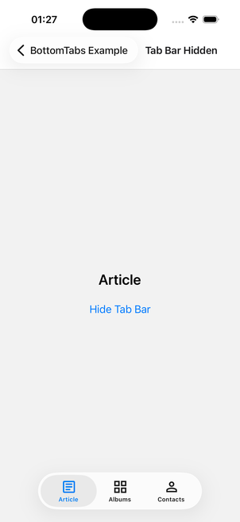
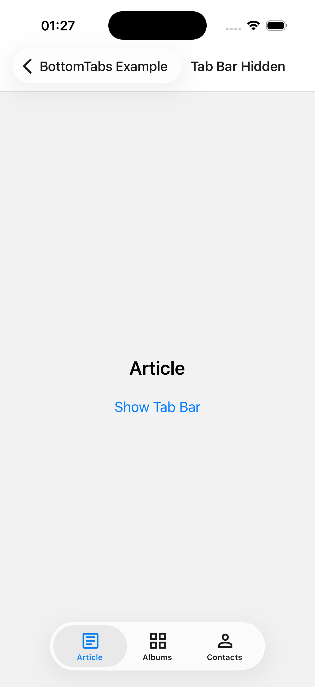
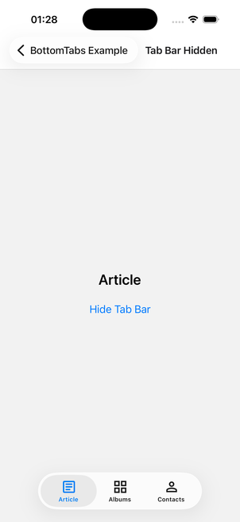
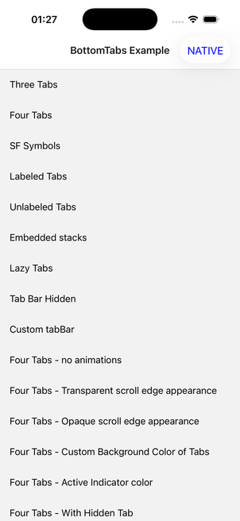
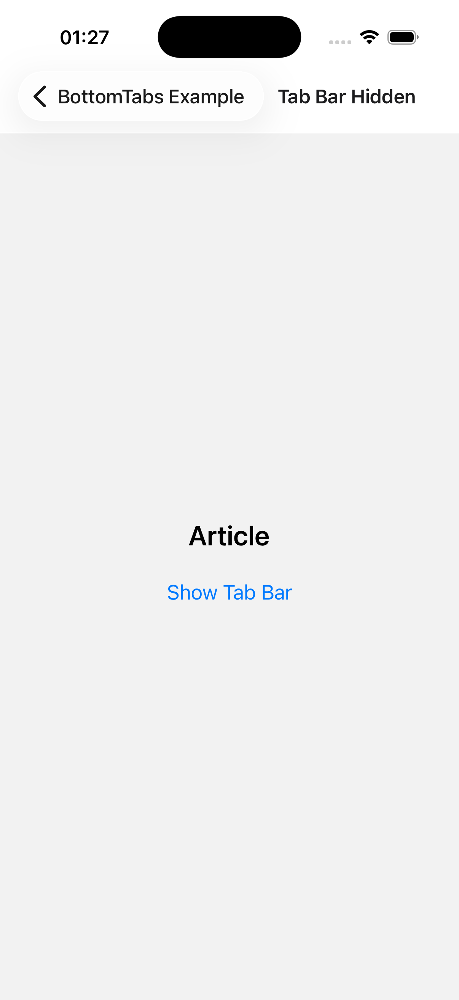

# ✅ FIX VERIFIED — callstack/react-native-bottom-tabs#524: fix(TabView): respect user-supplied tabBarHidden

PR: https://github.com/callstack/react-native-bottom-tabs/pull/524  
Issue(s): https://github.com/callstack/react-native-bottom-tabs/issues/521  
before = `6797d321ad`, after = `54283150c2`

| | before | after |
|---|---|---|
| verdict | `bug_present` | `bug_absent` |
| confidence | 0.98 | 0.98 |
| commit | `6797d321ad` | `54283150c2` |
| summary | After tapping 'Hide Tab Bar' on the 'Tab Bar Hidden' example screen, the button label changed to 'Show Tab Bar' (JS state toggled) but the native tab bar (Article, Albums, Contacts) remained on screen at the bottom of the view (y ~0.905-1.0 in describe output). tabBarHidden prop had no visible effect, matching the reported bug. | After tapping 'Hide Tab Bar' on the Tab Bar Hidden screen, the native tab bar fully disappears: describe shows no Tab Bar group and no Albums/Contacts items, and the screenshot shows only 'Article' and the 'Show Tab Bar' button on an otherwise empty screen. Tapping 'Show Tab Bar' restores the tab bar (Article/Albums/Contacts) as a control check. |
| recording | [before/recording.mp4](before/recording.mp4) | [after/recording.mp4](after/recording.mp4) |

## before — bug_present

| # | action | observed | screenshot |
|---|---|---|---|
| 1 | Launch bottomtabs.example | Home list 'BottomTabs Example' shown with rows including 'Tab Bar Hidden' visible without scrolling |  |
| 2 | Tap row 'Tab Bar Hidden' | Screen titled 'Tab Bar Hidden' appeared with text 'Article', button 'Hide Tab Bar', and a native tab bar at the bottom with items Article, Albums, Contacts |  |
| 3 | Baseline screenshot before toggling | Tab bar present with Article, Albums, Contacts |  |
| 4 | Tap button 'Hide Tab Bar' | Button label changed to 'Show Tab Bar', confirming the tap landed and JS state toggled |  |
| 5 | Decisive moment: await-screen-idle then describe + full-res screenshot | Native tab bar still visible at bottom (AXGroup 'Tab Bar' at y=0.905, height=0.095) with buttons 'Article', 'Albums', 'Contacts' all present; button reads 'Show Tab Bar'. Screenshot confirms tab bar pill visually present. Bug is present: tabBarHidden prop is ignored. |  |
| 6 | Tap 'Show Tab Bar' (control step) | Button label toggled back to 'Hide Tab Bar'; tab bar remains visible (as expected in both states, does not affect verdict) |  |

## after — bug_absent

| # | action | observed | screenshot |
|---|---|---|---|
| 0 | Launch bottomtabs.example and wait for idle | Home list 'BottomTabs Example' rendered with rows including Three Tabs, Four Tabs, Lazy Tabs, Tab Bar Hidden |  |
| 1 | Tap the 'Tab Bar Hidden' row (visible without scrolling at normalized y=0.544) | Navigated to the 'Tab Bar Hidden' screen showing 'Article' text, a 'Hide Tab Bar' button, and a native Tab Bar at the bottom with Article/Albums/Contacts |  |
| 2 | Tap 'Hide Tab Bar' | Button label changed to 'Show Tab Bar' (await-ui-element confirmed), proving the tap landed and JS state toggled |  |
| 3 | Decisive moment: await-screen-idle (~1s), then describe and full-resolution screenshot | describe lists only BackButton, 'Tab Bar Hidden' title, 'Article' text, and 'Show Tab Bar' button — no 'Tab Bar' group, no 'Albums', no 'Contacts' anywhere. Screenshot confirms an empty area below 'Show Tab Bar' with no tab bar visible. |  |
| 4 | Tap 'Show Tab Bar' (control step) | Tab bar reappeared with Article/Albums/Contacts and button label reverted to 'Hide Tab Bar' |  |

_Generated by argent-pr-verify on 2026-09-04T23:29:17Z._
